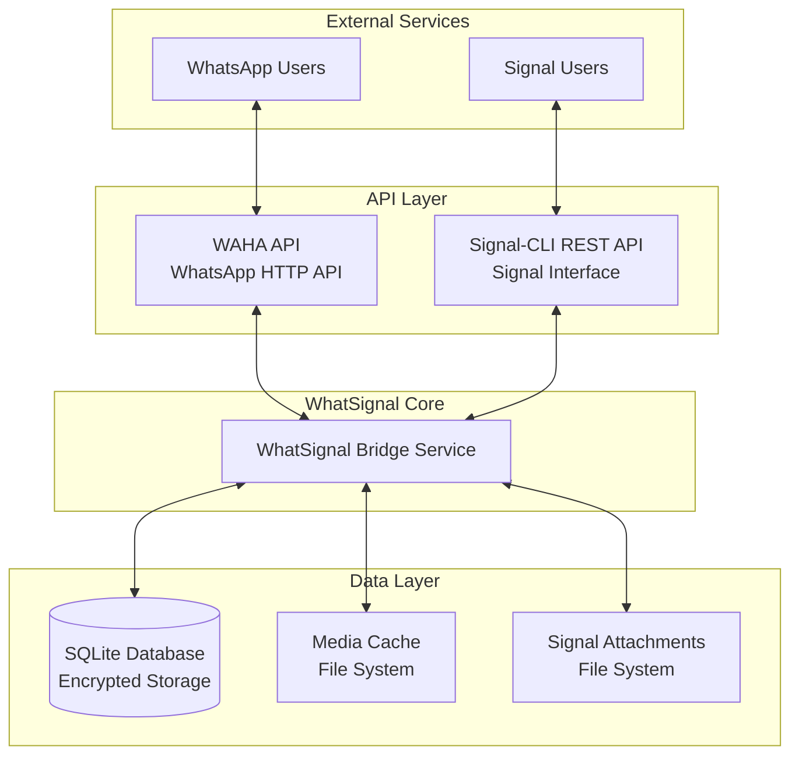
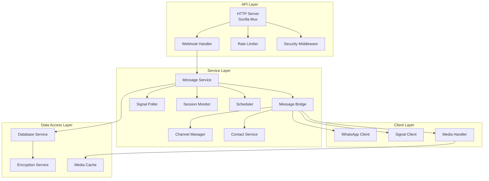
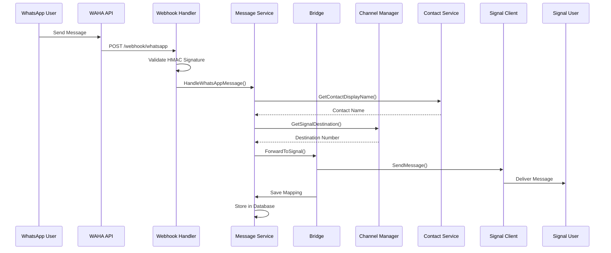
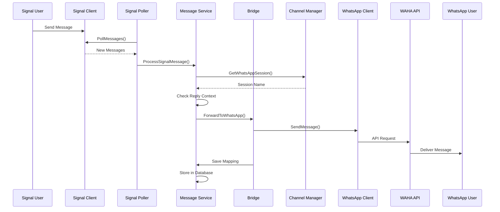
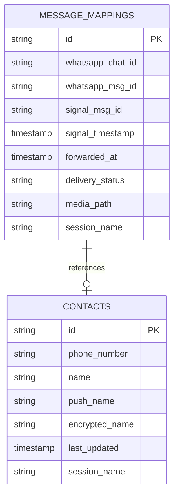
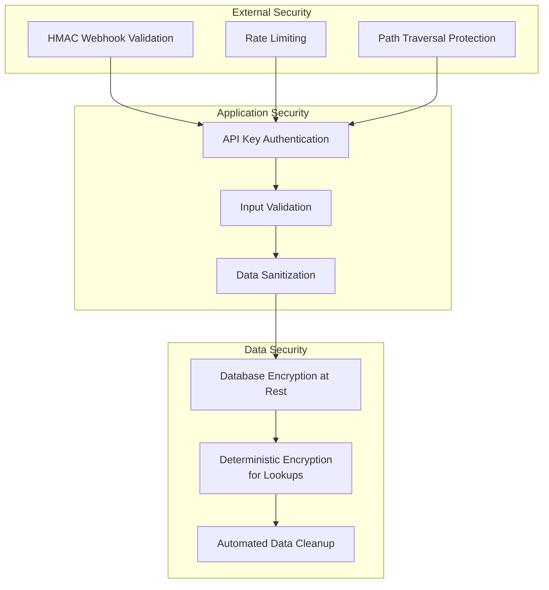
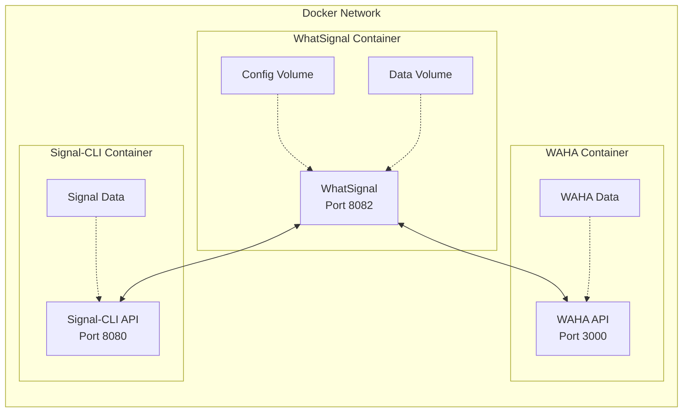

# WhatSignal Architecture

## Overview

WhatSignal is a bridge service that enables bidirectional communication between WhatsApp and Signal messaging platforms. It's built as a Go application with a modular, microservices-oriented architecture that ensures scalability, security, and reliability.

## System Architecture

### High-Level Architecture



## Component Architecture

### Core Components



## Message Flow

### WhatsApp to Signal Flow



### Signal to WhatsApp Flow



## Directory Structure

```
whatsignal/
├── cmd/                      # Application entry points
│   ├── whatsignal/          # Main application
│   │   ├── main.go          # Entry point
│   │   ├── server.go        # HTTP server
│   │   └── security.go      # Security middleware
│   └── migrate/             # Database migration tool
│
├── internal/                 # Private application code
│   ├── config/              # Configuration management
│   ├── constants/           # Application constants
│   ├── database/            # Database layer
│   │   ├── database.go      # DB operations
│   │   ├── encryption.go    # Data encryption
│   │   └── queries.go       # SQL queries
│   ├── migrations/          # Database migrations
│   ├── models/              # Data models
│   ├── security/            # Security utilities
│   └── service/             # Business logic
│       ├── bridge.go        # Message bridging
│       ├── channel_manager.go # Multi-channel support
│       ├── contact_service.go # Contact management
│       ├── message_service.go # Message handling
│       ├── scheduler.go     # Background tasks
│       ├── session_monitor.go # Session health
│       └── signal_poller.go # Signal message polling
│
├── pkg/                      # Public packages
│   ├── media/               # Media handling
│   ├── signal/              # Signal client
│   │   ├── client.go        # Signal API client
│   │   └── types/           # Signal types
│   └── whatsapp/            # WhatsApp client
│       ├── client.go        # WAHA API client
│       ├── session.go       # Session management
│       ├── webhook.go       # Webhook handling
│       └── types/           # WhatsApp types
│
├── scripts/                  # Deployment scripts
├── docs/                     # Documentation
└── docker-compose.yml        # Container orchestration
```

## Data Model

### Core Database Schema



## Security Architecture

### Security Layers



## Deployment Architecture

### Container Architecture



## Key Design Decisions

### 1. **Microservices Architecture**
- Separate concerns between WhatsApp (WAHA), Signal (Signal-CLI), and bridge logic
- Each service can be scaled and maintained independently
- Clear API boundaries between components

### 2. **Multi-Channel Support**
- Channel Manager maps WhatsApp sessions to Signal destinations
- Supports multiple concurrent WhatsApp-Signal conversation pairs
- Session-based routing for enterprise deployments

### 3. **Database Design**
- SQLite for simplicity and portability
- Encrypted storage for sensitive data
- Deterministic encryption for efficient lookups
- Message mapping table for bidirectional correlation

### 4. **Media Handling**
- Centralized media cache with automatic cleanup
- Support for multiple file formats (images, videos, documents, voice)
- Intelligent WAHA version detection for video compatibility
- Binary file type detection using content signatures

### 5. **Security First**
- HMAC validation for webhooks
- Rate limiting on API endpoints
- Path traversal protection
- Database encryption at rest
- Automated data retention policies

### 6. **Reliability Features**
- Message delivery tracking
- Retry mechanisms with exponential backoff
- Session health monitoring
- Graceful error handling
- Comprehensive logging

### 7. **Performance Optimizations**
- Contact caching (24-hour TTL)
- Startup contact sync
- Connection pooling
- Concurrent message processing
- Efficient database indexing

## Integration Points

### External APIs

1. **WAHA API (WhatsApp)**
   - REST API for WhatsApp operations
   - Webhook for incoming messages
   - Session management endpoints
   - Media upload/download

2. **Signal-CLI REST API**
   - REST API for Signal operations
   - Message sending/receiving
   - Attachment handling
   - Device registration

### Internal APIs

1. **Health Check Endpoint**
   - `/health` - System status
   - `/session/status` - Session health

2. **Webhook Endpoints**
   - `/webhook/whatsapp` - WAHA webhooks
   - HMAC signature validation
   - Rate limiting protection

## Scalability Considerations

1. **Horizontal Scaling**
   - Stateless application design
   - Database can be migrated to PostgreSQL
   - Media storage can use S3/object storage

2. **Performance**
   - Concurrent message processing
   - Efficient caching strategies
   - Optimized database queries
   - Connection pooling

3. **Monitoring**
   - Structured JSON logging
   - Health check endpoints
   - Metrics collection ready
   - Error tracking and alerting

## Future Architecture Considerations

1. **Message Queue Integration**
   - Add Redis/RabbitMQ for async processing
   - Better handling of high message volumes
   - Improved reliability with message persistence

2. **API Gateway**
   - Centralized authentication
   - Rate limiting at edge
   - Request routing and load balancing

3. **Observability**
   - OpenTelemetry integration
   - Distributed tracing
   - Metrics aggregation
   - Log centralization

4. **Multi-Region Support**
   - Database replication
   - CDN for media files
   - Regional failover

## Technology Stack

- **Language**: Go 1.22+
- **Web Framework**: Gorilla Mux
- **Database**: SQLite (with encryption)
- **Container**: Docker & Docker Compose
- **External Services**: WAHA, Signal-CLI REST API
- **Security**: HMAC, AES encryption, bcrypt
- **Logging**: Logrus (structured JSON)
- **Testing**: Go testing package (>80% coverage)